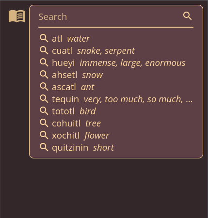
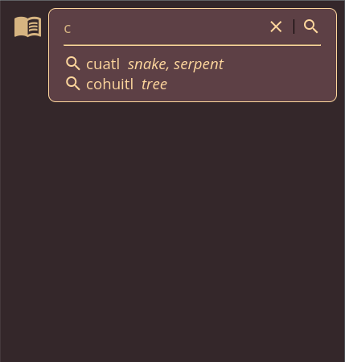
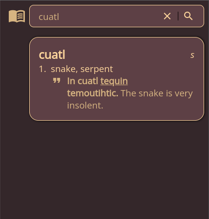
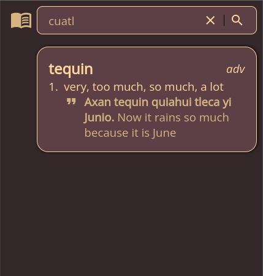
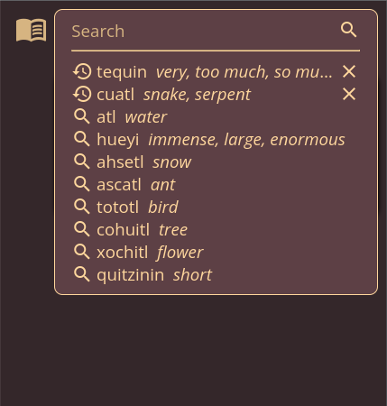

# Dictionary app

A dictionary app written in React and TypeScript with Jest and ESLint for testing.

## Features

- Base layer of easily testable pure functions (ex. [prefix-tree.ts](src/prefix-tree.ts)).
- [useContext](src/HistoryContext.tsx) to avoid prop drilling.
- [Testable](src/Search.test.tsx) and reusable [components](src/Search.tsx).
- [Composable CSS](src/style.css) similar to Tailwind.

## Screenshots

Home page:

Fast text search via a prefix tree (trie):

Result page:

Clickable links (ex. <u>tequin</u>) inside result:

Editable search history:

©️ Derek Cheung 2023
